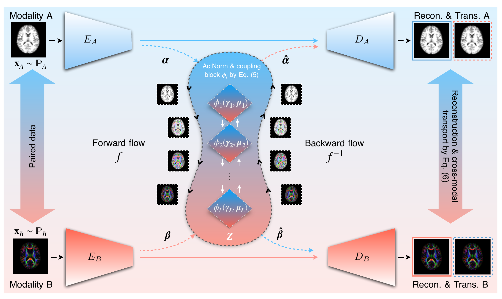

# FlowCycle: Rethinking Cycle Consistency via Exact Bijective Latent Flows

<p align="center">
  
</p>

Bidirectional image translation through one invertible latent flow: `A → B` runs
`f`, `B → A` runs `f⁻¹`.

## Installation

```bash
git clone https://github.com/Auroradsy/CycleFlow.git
cd CycleFlow
conda create -n flowcycle python=3.11 -y
conda activate flowcycle
pip install -r requirements.txt

export FLOWCYCLE_EXPS=/path/to/exps        # checkpoints and logs
export DATA=/path/to/datasets
```

## Data

Paired image folders, same file name on both sides:

```
<data_root>/trainA  trainB  testA  testB
```

**Synthetic MNIST MRI/PET**

```bash
python -m data.make_mnist_petct --paired_train \
    --mnist_raw $DATA/MNIST/raw --out $DATA/mnist_petct_paired
```

**Cityscapes** — the paired set from
[pix2pix](https://github.com/junyanz/pytorch-CycleGAN-and-pix2pix/blob/master/docs/datasets.md);
split each image into left (`A`, photo) and right (`B`, labels), `val` as test.

**ADNI T1 / FA** — request access at <https://adni.loni.usc.edu/> (not
redistributable). Preprocessing needs FSL.

```bash
python data/preprocess/register_t1_mni.py
python data/preprocess/resample_dti_2mm.py
python data/preprocess/build_labels.py

export ADNI_CACHE=$DATA/ADNI/paired_112.pt
export ADNI_LABELS=$DATA/ADNI/labels.csv
python -m data.build_cache
```

## Training

Each dataset takes three runs: the CycleGAN host, FlowCycle w/o TR, and
FlowCycle-TR (resumed from the same stage 2).

**ADNI**

```bash
HOST_TAG=host python train_host.py

python train.py --config configs/base.yaml --tag adni_base

python train.py --config configs/morph.yaml --tag adni_tr \
    --resume_stage 2 --resume_from $FLOWCYCLE_EXPS/adni/checkpoints/adni_base/stage2.pth \
    --w_path_gan 0 --w_path_smooth 1.0
```

**Synthetic MNIST MRI/PET**

```bash
R=$DATA/mnist_petct_paired
HOST=$FLOWCYCLE_EXPS/mnist/checkpoints/mnist_host/last.pth

HOST_TAG=mnist_host python train_host.py --data folder --data_root $R \
    --img_ch 3 --load_size 72 --crop_size 64 --no_flip \
    --epochs 100 --decay_start 50 --batch 64

python train.py --config configs/mnist_p_base.yaml --data_root $R --warm $HOST

python train.py --config configs/mnist_p_morph.yaml --data_root $R --warm $HOST \
    --tag mnist_p_tr \
    --resume_stage 2 --resume_from $FLOWCYCLE_EXPS/mnist/checkpoints/mnist_p_base/stage2.pth \
    --w_gan 0.1 --w_path_gan 0 --w_path_smooth 0.3
```

**Cityscapes**

```bash
export CYCLEFLOW_DATASET=cityscapes
R=$DATA/cityscapes_paired
HOST=$FLOWCYCLE_EXPS/cityscapes/checkpoints/cityscapes_host/last.pth

HOST_TAG=cityscapes_host python train_host.py --data folder --data_root $R \
    --img_ch 3 --load_size 286 --crop_size 256 --n_blocks 9 \
    --epochs 160 --decay_start 80 --batch 8

python train.py --config configs/p2p_base.yaml --data_root $R --warm $HOST \
    --tag cityscapes_base

python train.py --config configs/p2p_base.yaml --data_root $R --warm $HOST \
    --tag cityscapes_tr \
    --resume_stage 2 --resume_from $FLOWCYCLE_EXPS/cityscapes/checkpoints/cityscapes_base/stage2.pth \
    --variant morph --w_latcyc 2.0 --w_path_gan 0 --w_path_smooth 1.0
```

## Evaluation

SSIM / PSNR against the paired targets on the held-out split.

```bash
python -m utils.eval_adni_recon --tags adni_base adni_tr
python -m utils.eval_mnist --root $DATA/mnist_petct_paired --tags mnist_p_base mnist_p_tr
```

## Acknowledgements

Built on [pytorch-CycleGAN-and-pix2pix](https://github.com/junyanz/pytorch-CycleGAN-and-pix2pix).
